Components that are harvested from iMac 27" 2011.
The goal of this harvest is to see if I can reuse these components in other projects.

The webcamera- and bluetooth-pcb came with the same wiring bundle.

## Webcam

**Purpose**: Reuse this webcam as a USB webcam.

I managed to figure out which cables was USB signals and soldered on the wires to a USB type-A. The camera works.

Next step is to figure out what's the other cables (red and grey) functions.

Next step is to figure out what's the other cables (red and grey) functions.

### Chips

#### VC0338BSHB

From [vimicro.com](http://www.vimicro.com/english/product/d_vc0338.htm):

*VC0338* is a dedicated PC Camera controller chip targeting for high quality standard-alone PC Camera or Notebook PC Embedded Camera. With its integrated high quality ISP and MJPEG compression engine, VC0338 can video stream HD (720P), SXGA at 30fps, and 2 Mega at 15fps.

This chip utilizes the most up-to-date technologies and offering a vast variety of functions for enhancing Web camera multimedia experiences.

Being Microsoft WHQL compliant, as well as supporting USB Video Class 1.0 standard and USB Audio Class 1.0 standard, this state-of-the-art design is a versatile solution that makes the creation of high speed, high resolution, high performance, low power Web cameras into a reality.

#### SST39LF010

From [microchip.com](https://www.microchip.com/wwwproducts/en/SST39LF010):

The SST39LF010 is a 128K x8CMOS Multi-Purpose Flash (MPF) manufactured with SST proprietary, high performance CMOS SuperFlash technology. The split-gate cell design and thick-oxide tunneling injector attain better reliability and manufacturability compared with alternate approaches. The SST39LF010 device writes (Program or Erase) with a 3.0-3.6V power supply. The device conforms to JEDEC standard pinouts for x8 memories

#### TI14A1HX1

Unsure what this chip is.

### Pin-outs

|Pin|Color|Use|USB Cable|
|---|---|---|---|
|1|Black|Common GND|Shield|
|2|Red|||
|3|Grey / Black| ||
|4|Brown|USB GND|Black|
|5|White|USB D+|Green|
|6|Purple|USB D-|White|
|7|Blue|USB VCC|Red|

### Images

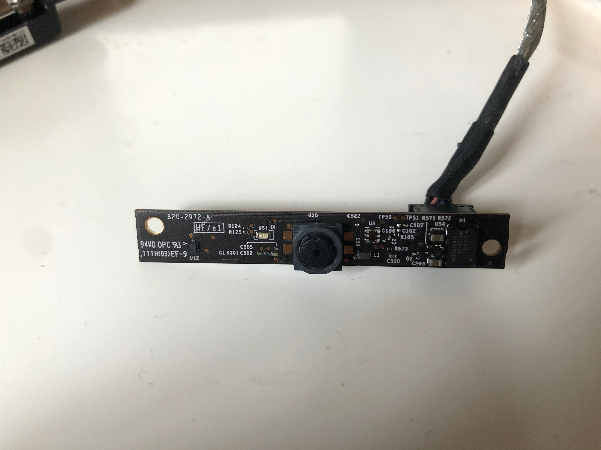
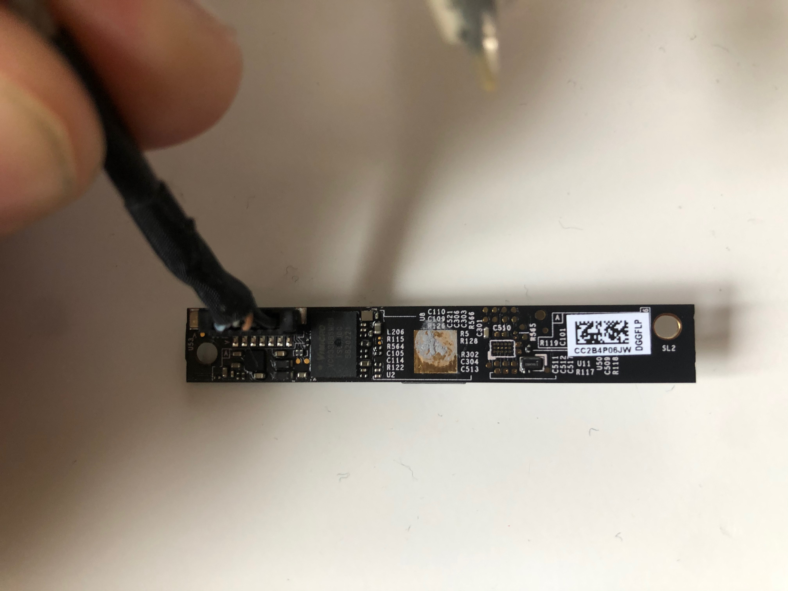
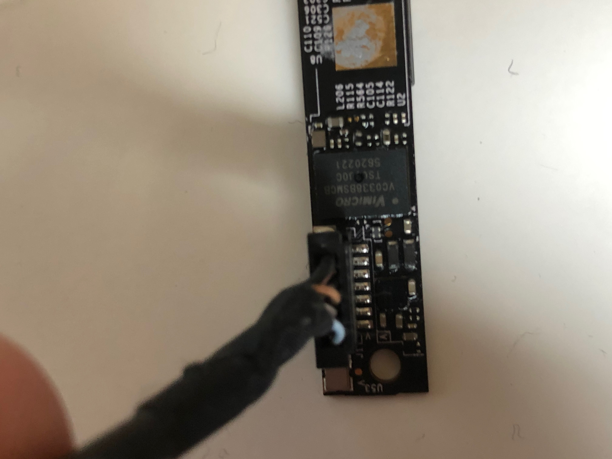
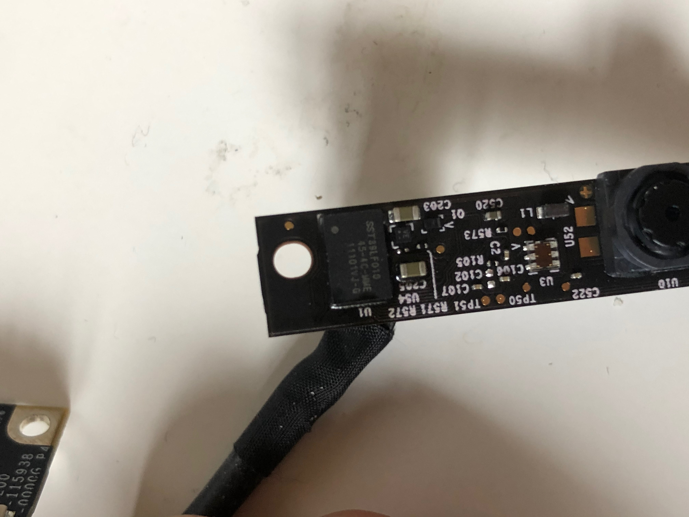
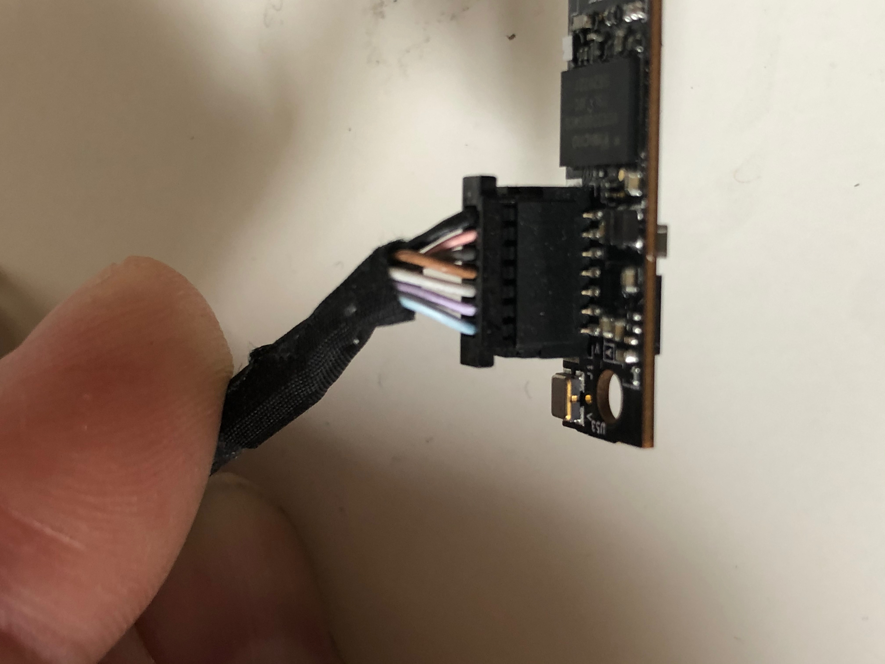

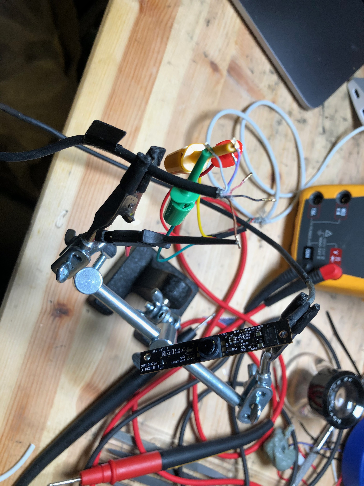
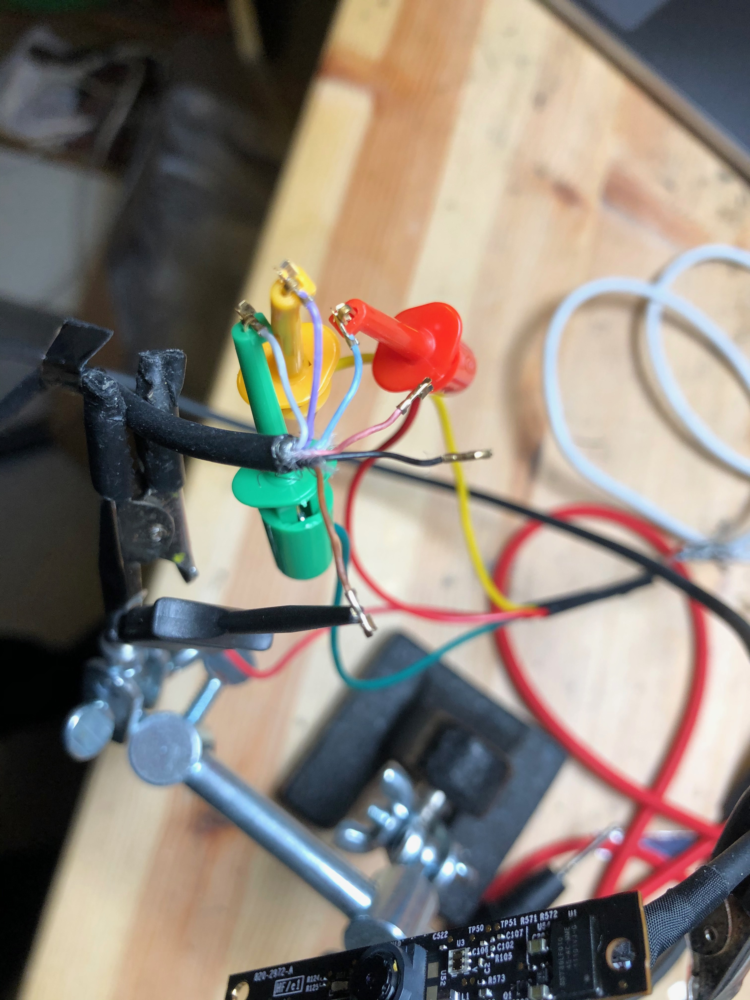
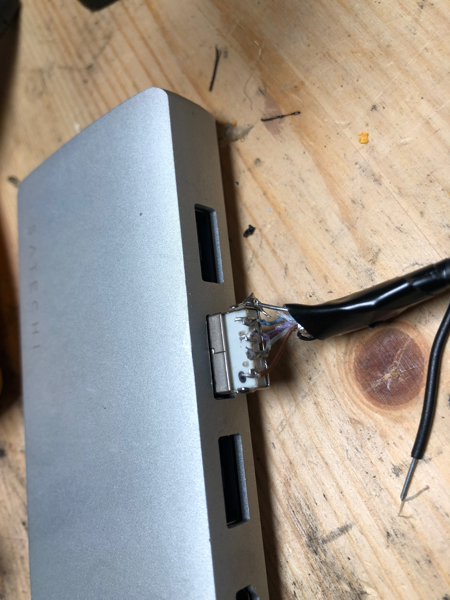
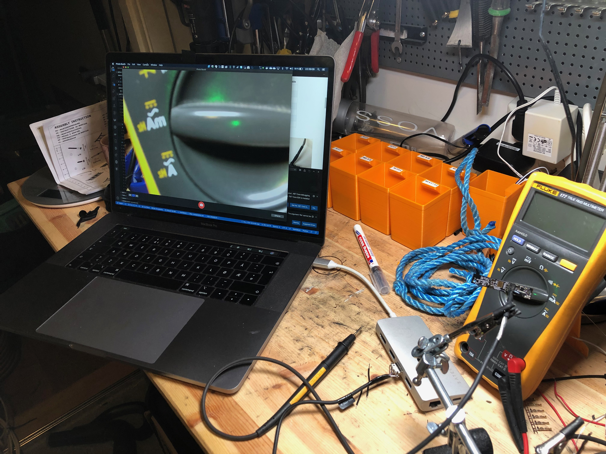
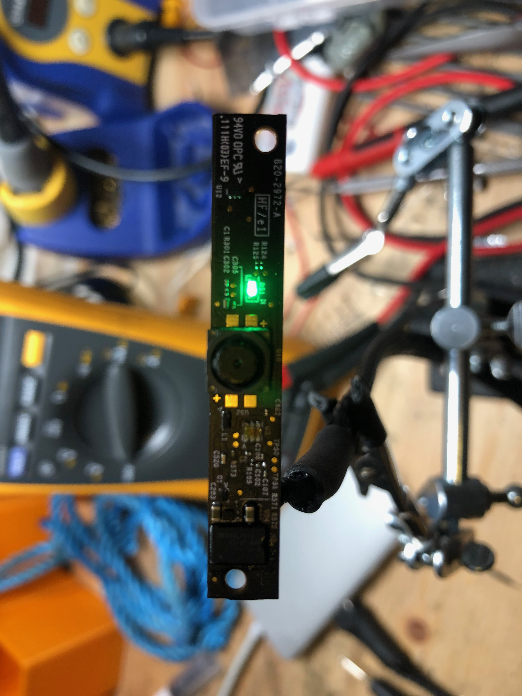

### Links

- [PDF: VC0331 Product Brief](./files/VC0331_200_1.0_EN.pdf)
- [vimicro.com: VC0338 Product information](http://www.vimicro.com/english/product/d_vc0338.htm)
- [microchip.com: SST39LF010 - 1Mb 3-3.6V Parallel Flash](https://www.microchip.com/wwwproducts/en/SST39LF010)

## Bluetooth

### Images

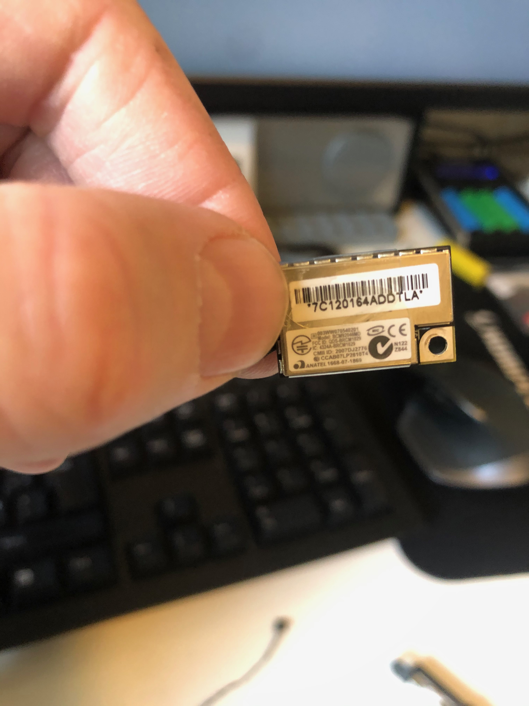
