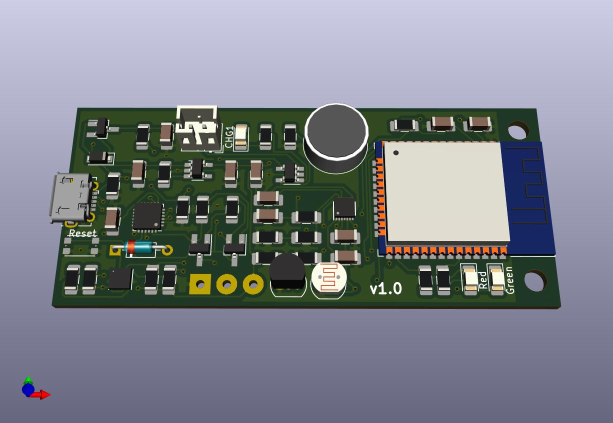
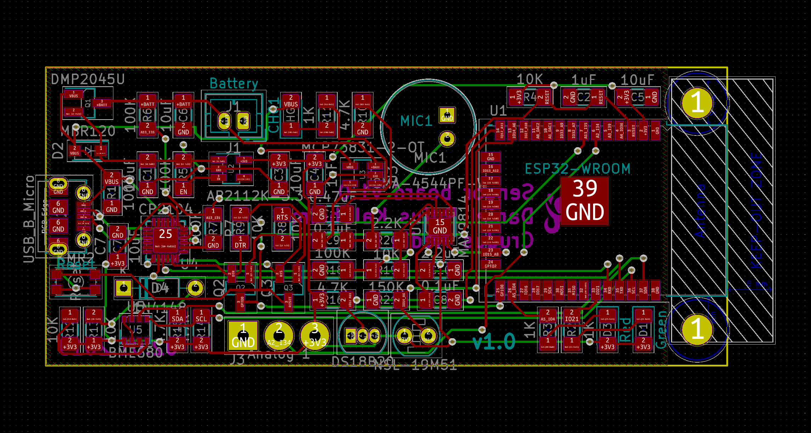
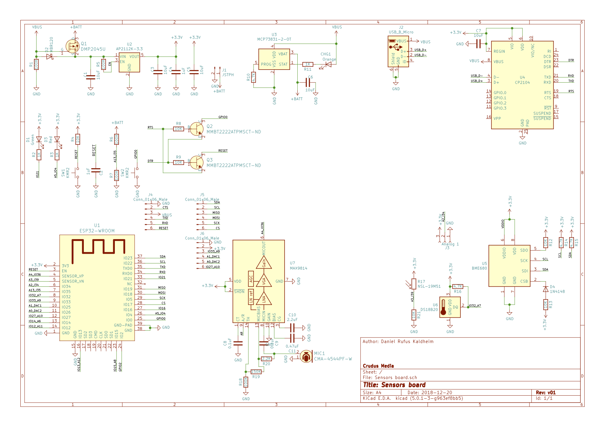

\newpage
\blandscape

## BLE device configuration specification

| Name                     | Type                     | R/W | Key          | UUID                                 | Comment                                                   |
| ------------------------ | ------------------------ | --- | ------------ | ------------------------------------ | --------------------------------------------------------- |
| Device name              | String                   | R/W | deviceName   | 5759f8cc-69ee-11e9-8a12-1681be663d3e |                                                           |
| WiFi Mac                 | String                   | R   |              | 51ecb1ca-6b85-11e9-a923-1681be663d3e | Read from ESP and register device to Crudus sense backend |
| WiFi SSID                | String                   | R/W | wifi-ssid    | 51ecb440-6b85-11e9-a923-1681be663d3e |                                                           |
| WiFi passwd              | String                   | W   | wifi-pwd     | 51ecb594-6b85-11e9-a923-1681be663d3e |                                                           |
| Room                     | String                   | R/W | loc-room     | 51ecb6ca-6b85-11e9-a923-1681be663d3e |                                                           |
| Floor                    | Integer?                 | R/W | loc-floor    | 51ecb7f6-6b85-11e9-a923-1681be663d3e |                                                           |
| Compound                 | String                   | R/W | Loc-comp     | 51ecb922-6b85-11e9-a923-1681be663d3e |                                                           |
| MQTT topic               | String                   | R/W | mqtt-topic   | 51ecba4e-6b85-11e9-a923-1681be663d3e | Only if MQTT-host is changed                              |
| MQTT host                | String                   | R/W | mqtt-host    | 51ecbf26-6b85-11e9-a923-1681be663d3e | Disables default mqtt host                                |
| MQTT port                | Integer                  | R/W | mqtt-port    | 51ecc156-6b85-11e9-a923-1681be663d3e | Only if MQTT-host is changed                              |
| MQTT username            | String                   | R/W | mqtt-user    | 51ecc2c8-6b85-11e9-a923-1681be663d3e | Only if MQTT-host is changed                              |
| MQTT password            | String                   | W   | mqtt-pwd     | 51ecc3fe-6b85-11e9-a923-1681be663d3e | Only if MQTT-host is changed                              |
| Crudus Accounts username | String                   | W   | crudus-user  | 51ecc52a-6b85-11e9-a923-1681be663d3e | For setting default MQTT topic and MQTT username          |
| Crudus Accounts token    | String                   | W   | crudus-token | 51ecc6d8-6b85-11e9-a923-1681be663d3e | For OTA downloads and MQTT password / token               |
| Calibration temperature  | String (comma separated) | R/W | cali-temp    | 51ecca5c-6b85-11e9-a923-1681be663d3e | For calibrate temperature                                 |
| Calibration humidity     | String (comma separated) | R/W | cali-hum     | 51eccbb0-6b85-11e9-a923-1681be663d3e | For calibrate humidity                                    |
| Soft reset               | boolean                  | W   | soft-reset   | 51eccd18-6b85-11e9-a923-1681be663d3e | For clearing preferences                                  |

\elandscape
\newpage

## MQTT publish Topics

| Topic | Payload | Comment |
| ----- | ------- | ------- |
|       |         |         |

## MQTT Subscribe Topics

| Topic      | Payload | Action               | Comment |
| ---------- | ------- | -------------------- | ------- |
| /sense/ota |         | Calls OTA for update |         |

## Extensions

### CCS811

Alternativ chip: CCS811 (indoor air quality sensor)

- [ADAFRUIT CCS811 AIR QUALITY SENSOR BREAKOUT - VOC AND ECO2](https://www.adafruit.com/product/3566)

## Functionality

### Sleeptracking

- [Sleep Tracking using an Arduino](https://duino4projects.com/sleep-tracking-using-an-arduino/)

### Softreset via button

- [LONG PRESS RESET BUTTON?](https://www.esp8266.com/viewtopic.php?t=9558&start=8)

### Send and recieve IR commands

- [Adafruit: Sending IR Codes](https://learn.adafruit.com/using-an-infrared-library/sending-ir-codes)
- [Github: IRremoteESP8266](https://github.com/crankyoldgit/IRremoteESP8266)

### External temperature sensor

- [PlatformIO: DallasTemperature](https://platformio.org/lib/show/54/DallasTemperature/examples)

## Bluetooth

- [Vendor list](https://gitlab.com/wireshark/wireshark/raw/master/manuf)
- [Company identifiers](https://www.bluetooth.com/specifications/assigned-numbers/company-identifiers/)
- [ESP Bluetooth collector](https://github.com/tobozo/ESP32-BLECollector)
- [ESP32 MP3 Decoder](https://github.com/MrBuddyCasino/ESP32_MP3_Decoder)
- [How to Calculate Distance from the RSSI value of the BLE Beacon](https://iotandelectronics.wordpress.com/2016/10/07/how-to-calculate-distance-from-the-rssi-value-of-the-ble-beacon/)
