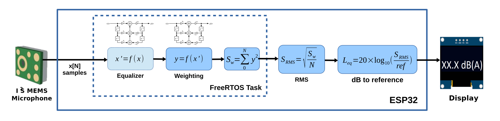

## Todo

- [ ] Clean up main.cpp
  - [ ] Segment out setup for sensory
- [ ] MQTT
  - [-] Setup MQTT with new auth (token) and topics
    - [X] Failed to connect with JWT-token. The token is too long to be sent via current library
      - [ ] Check other libraries
        - [ ] Check [Espressif MQTT Protocol](https://docs.espressif.com/projects/esp-idf/en/latest/esp32/api-reference/protocols/mqtt.html)
  - [ ] Setup MQTT to subscribe to updates from server
  - [X] Add posibility to override MQTT settings
  - [ ] Setup [MQTT Auto discovery](https://www.home-assistant.io/docs/mqtt/discovery/) for Home assistant
- [ ] OTA
  - [X] Remove hardcoded token
  - [X] Use JWT token to authenticate with backend
  - [ ] Get https working on ESP
    - [ ] Pull CA-cert from letsencrypt via http
  - [ ] OTA on demand (MQTT or BLE)
  - [ ] Ability to opt-out of auto updates
- [ ] Sensors
  - [X] Clean up MQTT JSON types - some are strings that should be int's.
  - [ ] Calibrate ADC
  - [ ] BSEC
    - [ ] Setup first time calibration sequence
    - [X] Check updates for Algo library
    - [X] Inject calibration variables to BSEC from preferences
    - [X] Store IAQ state to preferences
  - [ ] Pressure / altitude
    - [ ] Subscribe or fetch pressure by sea-level for altitude sensor
  - [ ] Audio
    - [ ] Get DB-like values
  - [ ] Battery
    - [ ] Better charing values
    - [ ] Calculate 0-100% again after changes to code for sampling
  - [ ] Photoresistor
    - [ ] Calculate 0-100% again after changes to code for sampling
- [ ] WiFi
  - [X] Remove hard-coded Wifi setup
  - [X] Handle no SSID / SSID Password for onboarding via bluetooth
- [ ] BLE / Bluetooth
  - [ ] Check out if current BLE setup can be used with / as a iBeacon
  - [ ] Configure pin security to device
  - [ ] Get RSSI from near **Sense** devices
  - [ ] Identify device by sending blink command via ble
- [ ] OLED Display
  - [ ] Setup layout for release
    - [ ] Air quality
    - [ ] Audio
    - [ ] Battery
    - [ ] Temperature / humidity
  - [ ] Move debug layout code from main.cpp into display class
- [ ] Build
  - [ ] Setup build in CI with the different options with sensory
- [ ] Other
  - [ ] Fix memory leaks
- [ ] Tests
  - [ ] Write tests

## Functionality

### Sleeptracking

- [Sleep Tracking using an Arduino](https://duino4projects.com/sleep-tracking-using-an-arduino/)

### Softreset via button

- [LONG PRESS RESET BUTTON?](https://www.esp8266.com/viewtopic.php?t=9558&start=8)

### Send and recieve IR commands

- [Adafruit: Sending IR Codes](https://learn.adafruit.com/using-an-infrared-library/sending-ir-codes)
- [Github: IRremoteESP8266](https://github.com/crankyoldgit/IRremoteESP8266)

### External temperature sensor

- [PlatformIO: DallasTemperature](https://platformio.org/lib/show/54/DallasTemperature/examples)

## Bluetooth

- [Vendor list](https://gitlab.com/wireshark/wireshark/raw/master/manuf)
- [Company identifiers](https://www.bluetooth.com/specifications/assigned-numbers/company-identifiers/)
- [ESP Bluetooth collector](https://github.com/tobozo/ESP32-BLECollector)
- [ESP32 MP3 Decoder](https://github.com/MrBuddyCasino/ESP32_MP3_Decoder)
- [How to Calculate Distance from the RSSI value of the BLE Beacon](https://iotandelectronics.wordpress.com/2016/10/07/how-to-calculate-distance-from-the-rssi-value-of-the-ble-beacon/)

## Notes

### Interrupts

- [Configuring & Handling ESP32 GPIO Interrupts In Arduino IDE](https://lastminuteengineers.com/handling-esp32-gpio-interrupts-tutorial/)
- [PIO Platform espressif32](https://docs.platformio.org/en/latest/platforms/espressif32.html)

### ADC

- [ESP32 How to correct the ADC](https://github.com/MacLeod-D/ESP32-ADC)
- [How to use ADC of ESP32 – Measuring voltage example](https://microcontrollerslab.com/adc-esp32-measuring-voltage-example/)

### IAQ - BSEC

[BSEC documentation](./lib/BSEC-Arduino-library/README.md)

**IAQ Accuracy=0** could either mean:

BSEC was just started, and the sensor is stabilizing (this lasts normally 5min in LP mode or 20min in ULP mode),
there was a timing violation (i.e. BSEC was called too early or too late), which should be indicated by a warning/error flag by BSEC,

**IAQ Accuracy=1** means the background history of BSEC is uncertain. This typically means the gas sensor data was too stable for BSEC to clearly define its references,

**IAQ Accuracy=2** means BSEC found a new calibration data and is currently calibrating,

**IAQ Accuracy=3** means BSEC calibrated successfully.

### JSON

- [JSON size allocation assistant](https://arduinojson.org/v6/assistant/)

### Audio

| dB    | Example                         |
| ----- | ------------------------------- |
| 120dB | Threshold of pain, Thunder      |
| 110dB | Concerts, screaming child       |
| 100dB | Motorcycle, blowdryer           |
| 90dB  | Diesel truck, Power mower       |
| 80dB  | Loud music, alarm clocks        |
| 70dB  | Busy traffic, vacuum cleaner    |
| 60dB  | Normal conversation at 1 meter  |
| 50dB  | Quiet office, moderate rainfall |
| 40dB  | Quiet library, bird calls       |
| 30dB  | Whisper, quiet rual area        |
| 20dB  | Rusling leaves, ticking watch   |
| 10dB  | Almost quiet, breathing         |

Measure with [tone generator](https://www.szynalski.com/tone-generator/) and find coefficients with [Linear Regression Calculator](https://www.socscistatistics.com/tests/regression/default.aspx).


For next revision: i2c microphone



```cpp
float spl = ( 20 * log( adcMax - adcMin )) + 35.13;
```

#### Components

##### MAX9814

The MAX9814 is a low-cost, high-quality microphone amplifier with automatic gain control (AGC) and low-noise microphone bias.

- [Datasheet](https://datasheets.maximintegrated.com/en/ds/MAX9814.pdf)

###### Note

Pin 14, **TH**: AGC Threshold Control. TH voltage sets gain control threshold. Connect TH to MICBIAS to disable
the AGC. To disable AGC we can remove resistor **R20** and **R19**, and solder a bridge between the pads on **R19**.

##### CMA-4544PF-W

Electret condenser microphone.

- [Datasheet](https://www.cuidevices.com/product/resource/cma-4544pf-w.pdf)

#### Articles

- [Adafruid: Measuring dB with MAX9814](https://forums.adafruit.com/viewtopic.php?t=94374)
- [Arduino Frequency Detection](https://www.instructables.com/id/Arduino-Frequency-Detection/)
- [Arduino Whistle Detector Switch using Sound Sensor](https://circuitdigest.com/microcontroller-projects/arduino-whistle-detector-switch)
- [ESP32 Voice Streamer](https://www.hackster.io/julianso/esp32-voice-streamer-52bd7e)
- [esp32_SoundRecorder](https://github.com/MhageGH/esp32_SoundRecorder)
- [Measure Sound/Noise Level in dB with Microphone and Arduino](https://circuitdigest.com/microcontroller-projects/arduino-sound-level-measurement/)
- [PICCOLO: Tiny Arduino music visualizer!](https://github.com/adafruit/Adafruit_Learning_System_Guides/tree/master/Tiny_Music_Visualizer)
- [Sound Level Meter with Arduino IDE, ESP32 and I2S MEMS microphone](https://github.com/ikostoski/esp32-i2s-slm)

### Light

Alternative to LDR is a BH1750 chip. This is for next revision?.

- [BH1750 Digital Light Sensor](https://www.instructables.com/id/BH1750-Digital-Light-Sensor/)
- [Design a Luxmeter Using a Light Dependent Resistor](https://www.allaboutcircuits.com/projects/design-a-luxmeter-using-a-light-dependent-resistor/)

Measure EV -> Lux with [Sekonic Flashmate](https://www.sekonic.com/sites/sekonic.com/files/Manuals/L-308S/l-308s_english.pdf) and find coefficients with the calculator used to find dB coefficient.

#### How to use an incident illuminance (LUX or FC) meter

[EV - Exposure value](https://en.wikipedia.org/wiki/Exposure_value)


1. Mount the Lumidisc accessory
2. Set EV mode and ISO 100.
3. Measure with the area to be measured parallel to the Lumidisc.
4. Determine the illuminance (lux) from the calculation table using the measured
EV.

##### EV Value -> Lux conversion table

| EV  | Lux | EV  | Lux  | EV   | Lux   | EV   | Lux     |
| --- | --- | --- | ---- | ---- | ----- | ---- | ------- |
| 0.0 | 2.5 | 5.0 | 80   | 10.0 | 2600  | 15.0 | 82000   |
| 0.5 | 3.5 | 5.5 | 110  | 10.5 | 3600  | 15.5 | 120000  |
| 1.0 | 5.0 | 6.0 | 160  | 11.0 | 5100  | 16.0 | 160000  |
| 1.5 | 7.1 | 6.5 | 230  | 11.5 | 7200  | 16.5 | 230000  |
| 2.0 | 10  | 7.0 | 320  | 12.0 | 10000 | 17.0 | 330000  |
| 2.5 | 14  | 7.5 | 450  | 12.5 | 14000 | 17.5 | 460000  |
| 3.0 | 20  | 8.0 | 640  | 13.0 | 20000 | 18.0 | 660000  |
| 3.5 | 28  | 8.5 | 910  | 13.5 | 29000 | 18.5 | 930000  |
| 4.0 | 40  | 9.0 | 1300 | 14.0 | 41000 | 19.0 | 1300000 |
| 4.5 | 57  | 9.5 | 1800 | 14.5 | 58000 | 19.5 | 1900000 |

## BLE device configuration specification

| Name                     | Type                     | R/W | Key          | UUID                                 | Comment                                                   |
| ------------------------ | ------------------------ | --- | ------------ | ------------------------------------ | --------------------------------------------------------- |
| Device name              | String                   | R/W | deviceName   | 5759f8cc-69ee-11e9-8a12-1681be663d3e |                                                           |
| WiFi Mac                 | String                   | R   |              | 51ecb1ca-6b85-11e9-a923-1681be663d3e | Read from ESP and register device to Crudus sense backend |
| WiFi SSID                | String                   | R/W | wifi-ssid    | 51ecb440-6b85-11e9-a923-1681be663d3e |                                                           |
| WiFi passwd              | String                   | W   | wifi-pwd     | 51ecb594-6b85-11e9-a923-1681be663d3e |                                                           |
| Room                     | String                   | R/W | loc-room     | 51ecb6ca-6b85-11e9-a923-1681be663d3e |                                                           |
| Floor                    | Integer?                 | R/W | loc-floor    | 51ecb7f6-6b85-11e9-a923-1681be663d3e |                                                           |
| Compound                 | String                   | R/W | Loc-comp     | 51ecb922-6b85-11e9-a923-1681be663d3e |                                                           |
| MQTT topic               | String                   | R/W | mqtt-topic   | 51ecba4e-6b85-11e9-a923-1681be663d3e | Only if MQTT-host is changed                              |
| MQTT host                | String                   | R/W | mqtt-host    | 51ecbf26-6b85-11e9-a923-1681be663d3e | Disables default mqtt host                                |
| MQTT port                | Integer                  | R/W | mqtt-port    | 51ecc156-6b85-11e9-a923-1681be663d3e | Only if MQTT-host is changed                              |
| MQTT username            | String                   | R/W | mqtt-user    | 51ecc2c8-6b85-11e9-a923-1681be663d3e | Only if MQTT-host is changed                              |
| MQTT password            | String                   | W   | mqtt-pwd     | 51ecc3fe-6b85-11e9-a923-1681be663d3e | Only if MQTT-host is changed                              |
| Crudus Accounts username | String                   | W   | crudus-user  | 51ecc52a-6b85-11e9-a923-1681be663d3e | For setting default MQTT topic and MQTT username          |
| Crudus Accounts token    | String                   | W   | crudus-token | 51ecc6d8-6b85-11e9-a923-1681be663d3e | For OTA downloads and MQTT password / token               |
| Calibration temperature  | String (comma separated) | R/W | cali-temp    | 51ecca5c-6b85-11e9-a923-1681be663d3e | For calibrate temperature                                 |
| Calibration humidity     | String (comma separated) | R/W | cali-hum     | 51eccbb0-6b85-11e9-a923-1681be663d3e | For calibrate humidity                                    |
| Soft reset               | boolean                  | W   | soft-reset   | 51eccd18-6b85-11e9-a923-1681be663d3e | For clearing preferences                                  |


## MQTT publish Topics

| Topic | Payload | Comment |
| ----- | ------- | ------- |
|       |         |         |

## MQTT Subscribe Topics

| Topic      | Payload | Action               | Comment |
| ---------- | ------- | -------------------- | ------- |
| /sense/ota |         | Calls OTA for update |         |

## Extensions

### CCS811

Alternativ chip: CCS811 (indoor air quality sensor)

- [ADAFRUIT CCS811 AIR QUALITY SENSOR BREAKOUT - VOC AND ECO2](https://www.adafruit.com/product/3566)
