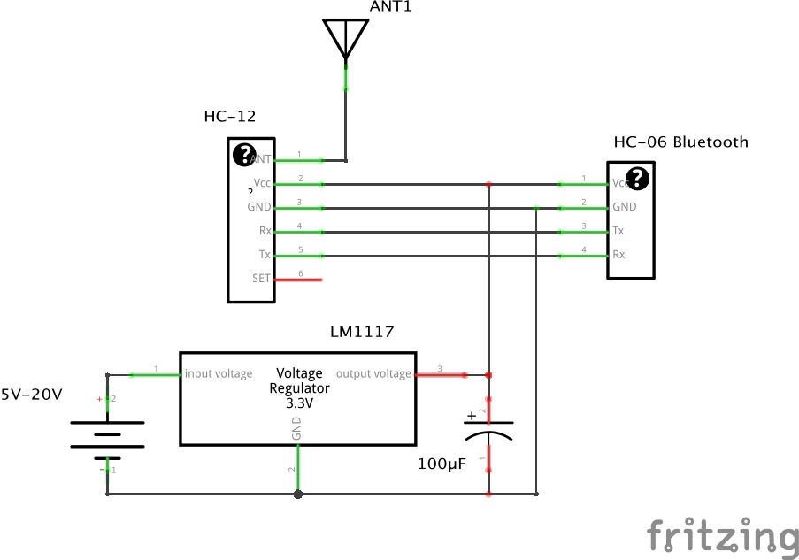

## Projects

- [High speed follow me - Telemetry link](./Telemetry-link.md)

## My 5" freestyle drone

### Drone components

| Type                     | Manufacturer    | Model                          | Link                                                                                                               | Comment                                  |
| ------------------------ | --------------- | ------------------------------ | ------------------------------------------------------------------------------------------------------------------ | ---------------------------------------- |
| Frame 5"                 | iFlight         | Cidora SL5 V2.1 HD             | [iFlight-rc.com](https://shop.iflight-rc.com/index.php?route=product/product&product_id=1369)                      |                                          |
| Flight controller        | Hobbywing       | XRotor Flight Controller F4 G3 | [hobbywing.com](http://hobbywing.com/goods.php?id=662)                                                             | Not in use. Changed to Mateksys F722-SE. |
| Flight controller        | Mateksys        | F722-SE F7 Dual Gryo           | [mateksys.com](http://www.mateksys.com/?portfolio=f722-se)                                                         |                                          |
| ESC                      | Hobbywing       | XRotor Micro 60A 4in1 ESC      | [hobbywing.com](http://hobbywing.com/goods.php?id=653)                                                             |                                          |
| FPV Camera               | Foxeer          | Micro Predator 5 Racing        | [foxeer.com](https://www.foxeer.com/foxeer-micro-predator-5-racing-fpv-camera-m8-lens-4ms-latency-super-wdr-g-304) |                                          |
| VTX                      | Team Blacksheep | VTX UNIFY PRO 5G8 V3           | [team-blacksheep.com](https://www.team-blacksheep.com/products/prod:unify_pro)                                     |                                          |
| VTX Antenna              | Team Blacksheep | TBS Triumph Pro SMA            | [team-blacksheep.com](https://www.team-blacksheep.com/products/prod:triumph_pro_sma)                               |                                          |
| GPS                      | Mateksys        | GPS & COMPASS MODULE M8Q-5883  | [mateksys.com](http://www.mateksys.com/?portfolio=m8q-5883)                                                        |                                          |
| Receiver                 | FrSky           | R-XSR                          | [frsky-rc.com](https://www.frsky-rc.com/product/r-xsr/)                                                            |                                          |
| Props                    | HQ Ethix        | S5 5x4x3 Light Grey Combo      |                                                                                                                    |                                          |
| Transmitter              | Radiomaster     | TX16S                          | [radiomasterrc.com](https://www.radiomasterrc.com/article-77.html)                                                 |                                          |
| Video Receiver (goggles) | Fat Shark       | Recon V3                       | [fatshark.com](https://www.fatshark.com/product/recon-v3/)                                                         |                                          |

### Betaflight configuration

#### Rateprofile Settings

|       | RC Rate | Rate | RC Expo | Max Vel [deg/s] |
| ----- | :-----: | :--: | :-----: | :-------------: |
| Roll  | 1.27    | 0.72 | 0.10    | 907             |
| Pitch | 1.27    | 0.72 | 0.10    | 907             |
| Yaw   | 1.00    | 0.75 | 0.00    | 800             |

## Payload Drone
### RTK modules

[What is GPS RTK?](https://learn.sparkfun.com/tutorials/what-is-gps-rtk/all)

- [H-RTK F9P](https://shop.holybro.com/h-rtk-f9p_p1226.html)

### Flight controllers

- [Pixhawk 4](https://docs.px4.io/master/en/flight_controller/pixhawk4.html)

## High speed follow me - Telemetry link

This is a sketching of an idea of a high speed follow me drone.

A simple mobile application that get the current GPS data from the phone and sends it to the drone via RF. The drone will take the GPS data and add as waypoint to navigate to. Hopefully the drone will then follow the same path as the phone.

### Drone schematics

### Ground station schematics

### Resources

- [iNavFlight Missions](https://github.com/iNavFlight/inav/wiki/iNavFlight-Missions)
- [DIY wireless telemetry link for UAV](https://quadmeup.com/diy-wireless-telemetry-link-for-uav/)
- [Build your own TX antenna for FPV](https://www.rcgroups.com/forums/showthread.php?1159968-Build-your-own-TX-antenna-for-FPV)
- [How to log GPS coordinates in Taranis](https://oscarliang.com/log-gps-coordinates-taranis/)

### Component links

- [Geekcreit HC-12 433MHz SI4463](https://www.banggood.com/Geekcreit-HC-12-433MHz-SI4463-Wireless-Serial-Module-Wireless-Transceiver-Transmission-Serial-Communication-Data-Board-Remote-1000M-p-973522.html)
- [Geekcreit HC-06 Wireless bluetooth Transceiver](https://www.banggood.com/Geekcreit-HC-06-Wireless-bluetooth-Transceiver-RF-Main-Module-Serial-Geekcreit-for-Arduino-products-that-work-with-official-Arduino-boards-p-80364.html)

## Tello

- [Hello, Tello - Hacking Drones With Go](https://gobot.io/blog/2018/04/20/hello-tello-hacking-drones-with-go/)
- [Drone Programming With Python Course | 3 Hours | Including x4 Projects (2021)](https://www.youtube.com/watch?v=LmEcyQnfpDA)
