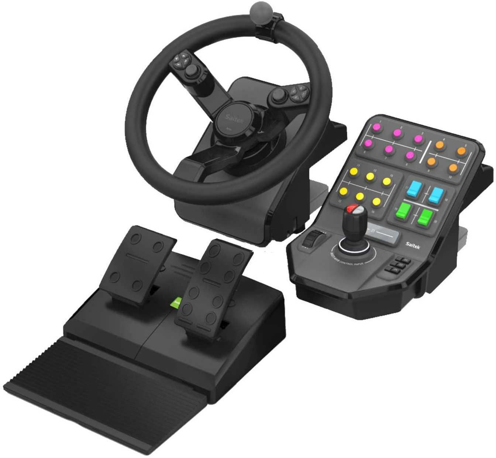
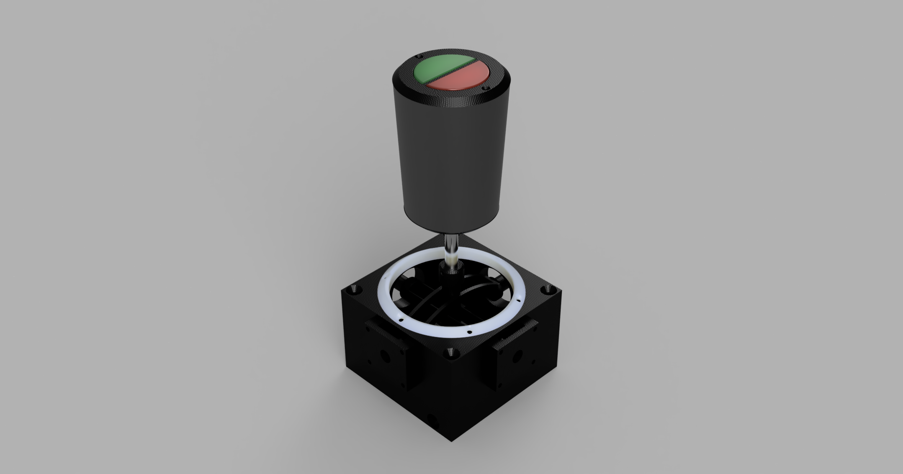

My son and I occationaly likes to play the simulator game Farming Simulator, and by inspiration of the Logitech G Farm Sim Controller I desided to build a joystick. This is the first step in making a controller unit for the game.

## Links

- [ArduinoJoystickLibrary](https://github.com/MHeironimus/ArduinoJoystickLibrary/tree/version-1.0)
