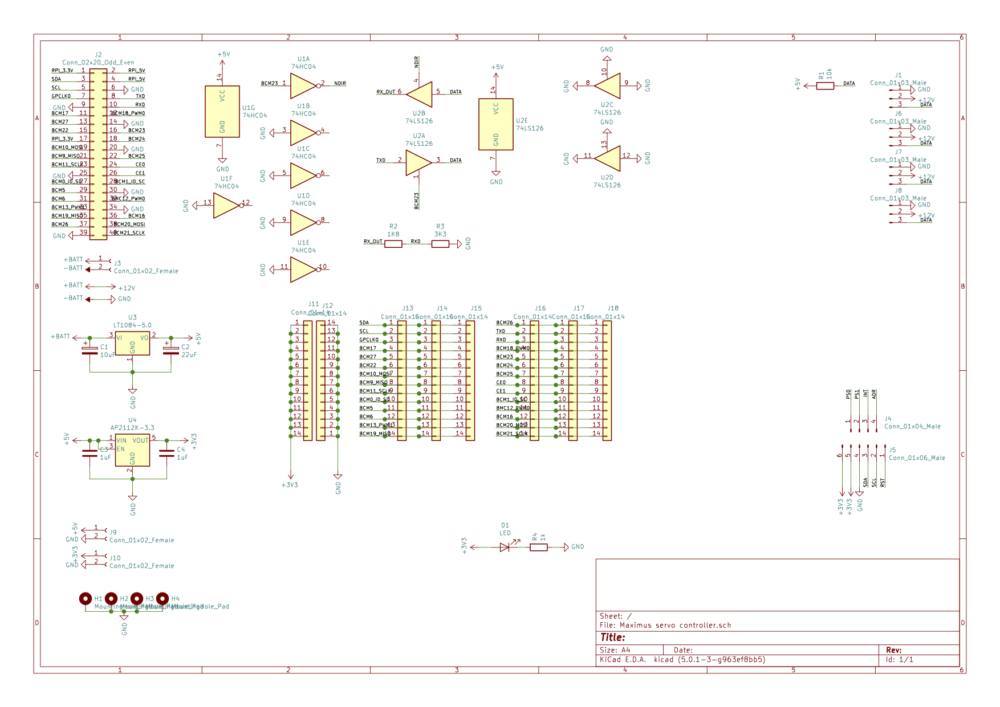
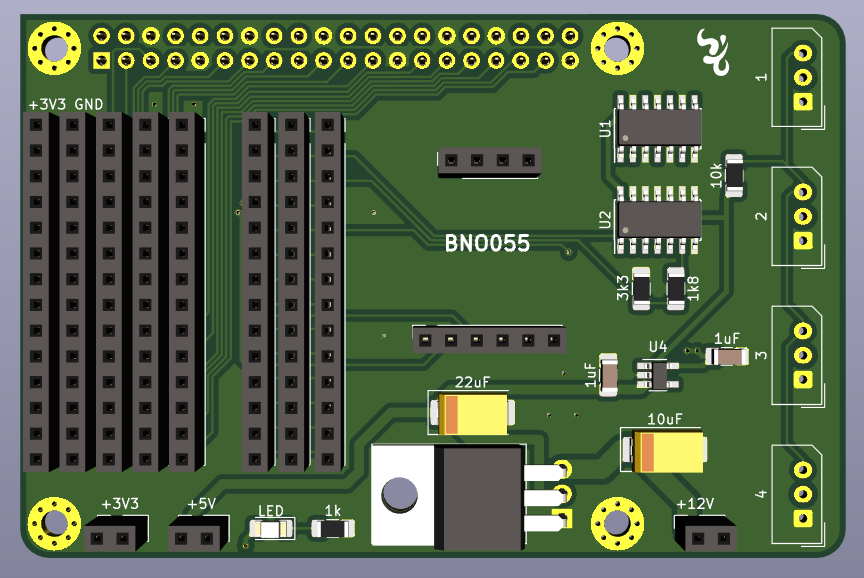

## Todo

| Tasks                                 | Timeline | Comment                    | Progress |
| ------------------------------------- | -------- | -------------------------- | -------- |
| Design middle body                    |          | Draw in Fusion 360         |          |
| Get development board circuit to work |          | Full duplex to half duplex |          |
| Set up ROS                            |          |                            |          |

## Body

### Frame v2 - current


### Frame v1

Frame v1 is to unstable. The whole body warps as the frame is to thin and have open cutouts for the legs.


## Components

- [Batteries](./Battery.md)
- [Configure BNO055](./BNO055.md)
- [Development board](./Development%20board.md)
- [Dynamixel AX-12](./Dynamixel%20AX-12.md)
- [GPS](./GPS.md)
- [Coral.ai - Dev Board Mini](https://coral.ai/products/dev-board-mini)
- [Other hardware](./Hardware.md)
- [Stereo Pi](https://www.antratek.com/stereopi-starter-kit)
- [ReSpeaker 4-Mic Array for Raspberry Pi](https://www.seeedstudio.com/ReSpeaker-4-Mic-Array-for-Raspberry-Pi.html)
- [Husky lens](https://www.dfrobot.com/huskylens.html)

## Robotics

- [Robotics](./robotics.md)
- [ROS](./ROS.md)

## Artificial Intelligence

- [AI Notes](./ai.md)

## Articles

- [Comparing Gyroscope Datasheets](https://learn.adafruit.com/comparing-gyroscope-datasheets)
- [PID Controller Implementation in Software](https://www.youtube.com/watch?v=zOByx3Izf5U)

## Inspiration

- [Inspiration notes](./inspiration.md)

## Books

- [Handbook of PI and PID controller tuning rules (3rd edition)](https://www.amazon.com/HANDBOOK-PID-CONTROLLER-TUNING-RULES/dp/1848162421/ref=sr_1_6?crid=LPT7MUFOO2C8&keywords=pid+controller&qid=1580382043&rnid=2941120011&s=books&sprefix=pid+con%2Caps%2C260&sr=1-6)
- [Model-Reference Robust Tuning of PID Controllers (Advances in Industrial Control)](https://www.amazon.com/Model-Reference-Controllers-Advances-Industrial-Control-ebook/dp/B01EUYVURI/ref=sr_1_3?crid=LPT7MUFOO2C8&keywords=pid+controller&qid=1580382043&rnid=2941120011&s=books&sprefix=pid+con%2Caps%2C260&sr=1-3)
- [PID Control Fundamentals](https://www.amazon.com/PID-Control-Fundamentals-Jens-Graf/dp/1535358661/ref=sr_1_2?crid=LPT7MUFOO2C8&keywords=pid+controller&qid=1580382043&rnid=2941120011&s=books&sprefix=pid+con%2Caps%2C260&sr=1-2)
- [PID Controllers: Theory, Design, and Tuning](https://www.amazon.com/PID-Controllers-Theory-Design-Tuning/dp/1556175167/ref=sr_1_1?crid=LPT7MUFOO2C8&keywords=pid+controller&qid=1580382043&rnid=2941120011&s=books&sprefix=pid+con%2Caps%2C260&sr=1-1)
- [Technician's Guide to Programmable Controllers](https://www.amazon.com/Technicians-Guide-Programmable-Controllers-Borden/dp/1111544093/ref=sr_1_1?crid=LPT7MUFOO2C8&keywords=pid+controller&qid=1580382097&rnid=2941120011&s=books&sprefix=pid+con%2Caps%2C260&sr=1-1)

## BNO055

Intelligent 9-axis absolute orientation sensor.


The BNO055 can output the following sensor data:

- **Absolute Orientation** (Euler Vector, 100Hz) Three axis orientation data based on a 360° sphere
- **Absolute Orientation** (Quatenrion, 100Hz) Four point quaternion output for more accurate data manipulation
- **Angular Velocity Vector** (100Hz) Three axis of 'rotation speed' in rad/s
- **Acceleration Vector** (100Hz) Three axis of acceleration (gravity + linear motion) in m/s^2
- **Magnetic Field Strength Vector** (20Hz) Three axis of magnetic field sensing in micro Tesla (uT)
- **Linear Acceleration Vector** (100Hz) Three axis of linear acceleration data (acceleration minus gravity) in m/s^2
- **Gravity Vector** (100Hz) Three axis of gravitational acceleration (minus any movement) in m/s^2
- **Temperature** (1Hz) Ambient temperature in degrees celsius


### Technical Details

- Dimensions: 20mm x 27mm x 4mm / 0.8" x 1.1" x 0.2"
- Header holes begin 4mm from the mounting holes
- Mounting Hole dimensions: 20mm x 12mm apart
- Uses I2C address 0x28 (default) or 0x29
- Weight: 3g

### Pinouts

#### Power Pins

- **VIN**: 3.3-5.0V power supply input
- **3VO**: 3.3V output from the on-board linear voltage regulator, you can grab up to about 50mA as necessary
- **GND**: The common/GND pin for power and logic

#### I2C Pins

- **SCL** - I2C clock pin, connect to your microcontrollers I2C clock line. This pin can be used with 3V or 5V logic, and there's a 10K pullup on this pin.
- **SDA** - I2C data pin, connect to your microcontrollers I2C data line. This pin can be used with 3V or 5V logic, and there's a 10K pullup on this pin.

#### Other Pins

- **RST**: Hardware reset pin.  Set this pin low then high to cause a reset on the sensor. This pin is 5V safe.
- **INT**: The HW interrupt output pin, which can be configured to generate an interrupt signal when certain events occur like movement detected by the accelerometer, etc. (not currently supported in the Adafruit library, but the chip and HW is capable of generating this signal). The voltage level out is 3V
- **ADR**: Set this pin high to change the default I2C address for the BNO055 if you need to connect two ICs on the same I2C bus. The default address is 0x28. If this pin is connected to 3V, the address will be 0x29
- **PS0** and **PS1**: These pins can be used to change the mode of the device (it can also do HID-I2C and UART) and also are provided in case Bosch provides a firmware update at some point for the ARM Cortex M0 MCU inside the sensor. They should normally be left unconnected.

### Installation

- [BNO055 - Python & CircuitPython](https://learn.adafruit.com/adafruit-bno055-absolute-orientation-sensor/python-circuitpython)

```bash
pip3 install RPI.GPIO
pip3 install adafruit-blinka
```

#### i2c configuration

- [I2C Clock Stretching](https://learn.adafruit.com/circuitpython-on-raspberrypi-linux/i2c-clock-stretching)

In order to use certain I2C sensors, such as the BNO055, you'll need to enable I2C clock stretching 'support' by greatly slowing down the I2C clock on the Raspberry Pi using the device tree overlay.


Edit _/boot/config.txt_

```bash
## Uncomment some of all of these to enable the optional hardware interfaces
dtparam=i2c_arm=on
dtparam=i2s=on
dtparam=spi=on

## Clock stretching by slowing down to 10KHz
dtparam=i2c_arm_baudrate=10000
```

Reboot the device

```bash
sudo reboot
```

Check for i2c devices:

```bash
$ i2cdetect -y 1
     0  1  2  3  4  5  6  7  8  9  a  b  c  d  e  f
00:          -- -- -- -- -- -- -- -- -- -- -- -- --
10: -- -- -- -- -- -- -- -- -- -- -- -- -- -- -- --
20: -- -- -- -- -- -- -- -- 28 -- -- -- -- -- -- --
30: -- -- -- -- -- -- -- -- -- -- -- -- -- -- -- --
40: -- -- -- -- -- -- -- -- -- -- -- -- -- -- -- --
50: -- -- -- -- -- -- -- -- -- -- -- -- -- -- -- --
60: -- -- -- -- -- -- -- -- -- -- -- -- -- -- -- --
70: -- -- -- -- -- -- -- --
```

#### Create new project

```bash
mkdir Maximus && cd Maximus
python3 -m venv .env
source .env/bin/activate
pip3 install adafruit-circuitpython-bno055
```

Example data from sensor:

```bash
Temperature: 28 degrees C
Accelerometer (m/s^2): (-0.2, -0.07, -9.77)
Magnetometer (microteslas): (-27.75, -4.0625, 32.5)
Gyroscope (rad/sec): (-0.001090830782496456, -0.004363323129985824, 0.0)
Euler angle: (None, None, None)
Quaternion: (0.011474609375, -0.3623046875, 0.9320068359375, 0.0)
Linear acceleration (m/s^2): (1.28, 0.0, -0.01)
Gravity (m/s^2): (-0.21, -0.08, -9.8)
```

### Notes

#### Merge accelerometer and GPS

- Accelerometer: High frequency, high accuracy
  - Absolute North east and down
  - acceleration: [ax ay az]
  - gyroscope:    [gx gy gz]
  - magnetometer: [mx my mz]
- GPS: Low frequency, low accuracy
  - Latitude, longitude and altitude

Accelerometer + GPS = predicted positions.

Kalman filter

```bash
[
     P = Position
     V = Velocity
]
```

- Predict(accelerometer)
- Update(GPS)

| Key | What                      | Matrix          | Comment                                |
| --- | ------------------------- | --------------- | -------------------------------------- |
| A   | state transition matrix   |                 |                                        |
| B   | control matrix            |                 |                                        |
| u   | control vector            |                 |                                        |
| Q   | process variance          | [o¹ 0<br/>0 o²] | https://en.wikipedia.org/wiki/Variance |
| R   | measurements variance     | [o¹ 0<br/>0 o²] |                                        |
| Z   | Actual measurement vector | [P<br/>V]       | Raw GPS readings                       |

Velocity readings are done using [Doppler shift](https://imagine.gsfc.nasa.gov/features/yba/M31_velocity/spectrum/doppler_more.html).

```Pf = π + vΔt + ½ aΔt²```

```Vf = Vi + aΔt```

```bash
[ P     [1 Δt                [½Δt²
  V ] =  0 1] x prev_state     Δt ] [ a ]
state     A     prev_State      B     u
```

Z = [PV] (GPS)

### PID controller

- [Arduino BNO055 PID Gyro sensor](https://gist.github.com/saschazar21/382376c5448a585c6b3d5f142e3c7af6)
- [PID Control for multiple linear actuators](https://forum.arduino.cc/index.php?topic=625875.0)
- [An introduction and tutorial for PID controllers (PDF)](./pdfs/pid_control_document.pdf)

### Documents

- [Datasheet](./pdfs/BST_BNO055_DS000_14.pdf)

### Videos

- [How to Implement an Inertial Measurement Unit (IMU) Using an Accelerometer, Gyro, and Magnetometer](https://www.youtube.com/watch?v=T9jXoG0QYIA)
- [How to Merge Accelerometer with GPS to Accurately Predict Position and Velocity](https://www.youtube.com/watch?v=6M6wSLD-8M8)
- [Understanding Kalman Filters](https://www.youtube.com/watch?v=mwn8xhgNpFY)

### Links

- [Adafruit BNO055](https://github.com/adafruit/Adafruit_BNO055)
- [Adafruit BNO055 absolute orientation sensor](https://learn.adafruit.com/adafruit-bno055-absolute-orientation-sensor/overview)

## Battery

Battery pack made of 3 cells in series harvested from an old MacBook Pro that will provide 11.1v with (fill in capacity)mAh.

### Weight


Each battery weighs around 85 grams.


For all three without cables and connections it's about 258 grams.

### Wiring

If each individual cell is rated for 3.7v @ 3000mAh and 20C discharge rate, the configuration above would result in a pack rated for 11.1v @ 3000mAh with a max discharge rate of 60 amps.


### Tools

- [Lipo Wiring](https://scriptasylum.com/rc_speed/lipo.html)

### Buy batteries

- [Batteri Online](https://batterionline.no/)
- [SONY US18650VTC6 - 30A](https://batterionline.no/sony-us18650vtc6-30a)

## Development board






### Whoopsies

#### Molex pinout

Molex pin 1 (GND) and pin 3 (DATA) have switched place.

From robotis webpage:
```WARNING: Check the pinout! The pinout of DYNAMIXEL can differ from the pinout of connector manufacturer.```

#### BNO055

Connection pins are mounted mirrored, resulting in the breakout board for BNO055 is upside down.

#### Raspberry pi

The distance between the connectors on the raspberry pi and the development board are just a little more than two 2x40 female pins connector when using standard (fill in mm) standoffs. This results in bad connection. Resolution will be a 3D-printed standoff.

### Raspberry Pi pinout


### Diagnostics


### Photos


## Dynamixel AX-12A

DYNAMIXEL is a robot exclusive smart actuator with fully integrated DC Motor + Reduction Gearhead + Controller + Driver + Network in one DC servo module.


### Specification

| Item                   | Specification                                                          |
| ---------------------- | ---------------------------------------------------------------------- |
| Baud Rate              | 7843 bps ~ 1 Mbps                                                      |
| Resolution             | 0.29 [°]                                                               |
| Running Degree         | 0 [°] ~ 300 [°] Endless Turn                                           |
| Weight                 | 53.5g(AX-12, AX-12+), 54.6g(AX-12A)                                    |
| Dimensions (W x H x D) | 32mm x 50mm x 40mm                                                     |
| Gear Ratio             | 254 : 1                                                                |
| Stall Torque           | 1.5 N*m (at 12V, 1.5A)                                                 |
| No Load Speed          | 59rpm (at 12V)                                                         |
| Operating Temperature  | -5 [°C] ~ +70 [°C]                                                     |
| Input Voltage          | 9.0 ~ 12.0V (**Recommended** : 11.1V)                                  |
| Command Signal         | Digital Packet                                                         |
| Protocol Type          | Half Duplex Asynchronous Serial Communication (8bit, 1stop, No Parity) |
| Physical Connection    | TTL Level Multi Drop Bus                                               |
| ID                     | 0 ~ 253                                                                |
| Feedback               | Position, Temperature, Load, Input Voltage, etc                        |
| Material               | Engineering Plastic                                                    |

### Wiring

| Item           | TTL                                                                                                                                                                   |
| -------------- | --------------------------------------------------------------------------------------------------------------------------------------------------------------------- |
| Pinout         | 1 GND<br />2 VDD<br />3 DATA                                                                                                                                          |
| Diagram        |                                                                                                                        |
| Housing        | <br />[MOLEX 50-37-5033](http://www.molex.com/molex/products/datasheet.jsp?part=active/0050375033_CRIMP_HOUSINGS.xml) |
| PCB Header     | <br />[MOLEX 22-03-5035](http://www.molex.com/molex/products/datasheet.jsp?part=active/0022035035_PCB_HEADERS.xml)    |
| Crimp Terminal | [MOLEX 08-70-1039](http://www.molex.com/molex/products/datasheet.jsp?part=active/0008701039_CRIMP_TERMINALS.xml)                                                      |
| Wire Gauge     | 21 AWG                                                                                                                                                                |

### TTL communications

To control the DYNAMIXEL actuators, the main controller needs to convert its UART signals to the half duplex type.

The recommended circuit diagram for this is shown below.


### Dimensions

Screws: M2x04 or M2x06


### Links

- [E-manual](http://emanual.robotis.com/docs/en/dxl/ax/ax-12a/)
- [Dynamixel SDK](https://github.com/ROBOTIS-GIT/DynamixelSDK)

### Raspberry pi

Set configuration parameters in /boot/config.txt:

```bash
enable_uart=1
init_uart_clock=16000000
```

### Communications

More information about communication [Protocol 1.0](http://emanual.robotis.com/docs/en/dxl/protocol1/#status-packet).

Instruction Packet is the command data sent to the Device.

| Header1 | Header2 | ID  | Length | Instruction | Param 1 | …   | Param N | Checksum |
| ------- | ------- | --- | ------ | ----------- | ------- | --- | ------- | -------- |
| 0xFF    | 0xFF    | ID  | Length | Instruction | Param 1 | …   | Param N | CHKSUM   |

#### Header

The field indicates the start of the Packet.

#### Packet ID

The field that indicates the ID of the Device that should receive the Instruction Packet and process it

1. Range : 0 ~ 253 (0x00 ~ 0xFD), which is a total of 254 numbers that can be used.
2. Broadcast ID : 254 (0xFE), which makes all connected devices execute the Instruction Packet.

#### Length

The length of the Packet(Instruction, Parameter, Checksum fields). Length = number of Parameters + 2

#### Instruction

The field that defines the type of instruction.

| Value | Instructions  | Description                                                                                                                                               |
| ----- | ------------- | --------------------------------------------------------------------------------------------------------------------------------------------------------- |
| 0x01  | Ping          | Instruction that checks whether the Packet has arrived to a device with the same ID as Packet ID                                                          |
| 0x02  | Read          | Instruction to read data from the Device                                                                                                                  |
| 0x03  | Write         | Instruction to write data on the Device                                                                                                                   |
| 0x04  | Reg Write     | Instruction that registers the Instruction Packet to a standby status; Packet is later executed through the Action instruction                            |
| 0x05  | Action        | Instruction that executes the Packet that was registered beforehand using Reg Write                                                                       |
| 0x06  | Factory Reset | Instruction that resets the Control Table to its initial factory default settings                                                                         |
| 0x08  | Reboot        | Instruction that reboots DYNAMIXEL(See applied products in the description)                                                                               |
| 0x83  | Sync Write    | For multiple devices, Instruction to write data on the same Address with the same length at once                                                          |
| 0x92  | Bulk Read     | For multiple devices, Instruction to write data on different Addresses with different lengths at once<br /> This command can only be used with MX series. |


#### Parameters

Parameters are used when additional data is required for an instruction.

#### Instruction Checksum

It is used to check if packet is damaged during communication. Instruction Checksum is calculated according to the following formula.

Instruction Checksum = ```~( ID + Length + Instruction + Parameter1 + … Parameter N )```

Where “~” is the Binary Ones Complement operator. When the calculation result of the parenthesis in the above formula is larger than 255 (0xFF), use only lower bytes.

For example, when you want to use below Instruction Packet,

```ID=1(0x01), Length=5(0x05), Instruction=3(0x03), Parameter1=12(0x0C), Parameter2=100(0x64), Parameter3=170(0xAA)```

```bash
Checksum = ~ ( ID + Length + Instruction + Parameter1 + … Parameter 3 ) = ~ [ 0x01 + 0x05 + 0x03 + 0x0C + 0x64 + 0xAA ] = ~ [ 0x123 ] # Only the lower byte 0x23 executes the Not operation. = 0xDC
```

Thus, Instruction Packet should be ```0xFF, 0xFF, 0x01, 0x05, 0x03, 0x0C, 0x64, 0xAA, 0xDC```.

#### Sample code

##### Simple Move

The values are hardcoded to move Dynamixel 1:

- Execute an action (5),
- send 3 bytes of data,
- MOVE command(1E) and 2 positions(32 03) followed by the CRC (A3).

I needed a small sleep(0.1), the port.write takes more time and the output was already LOW.

```python
##!/usr/bin/env python

import serial
import time
import RPi.GPIO as GPIO

GPIO.setmode(GPIO.BOARD)
GPIO.setup(16, GPIO.OUT)

port = serial.Serial("/dev/ttyAMA0", baudrate=1000000, timeout=3.0)

try:
    print("Write first hex sequence")
    GPIO.output(16, GPIO.HIGH)
    port.write(bytearray.fromhex("FF FF 01 05 03 1E 32 03 A3")) # 255 255 1 5 3 30 50 3 163
    time.sleep(0.1)
    GPIO.output(16, GPIO.LOW)

    time.sleep(3)

    print("Write second hex sequence")
    GPIO.output(16,GPIO.HIGH)
    port.write(bytearray.fromhex("FF FF 01 05 03 1E CD 00 0b"))
    time.sleep(0.1)
    GPIO.output(16,GPIO.LOW)

    print("Done")
    time.sleep(5)
except KeyboardInterrupt: # If CTRL+C is pressed, exit cleanly:
    print("Keyboard interrupt")

except:
    print("some error")

finally:
    print("clean up")
    GPIO.cleanup() # cleanup all GPIO
```

##### Read ID

The ID is a unique value in the network to identify each DYNAMIXEL with an Instruction Packet. 0~252 (0xFC) values can be used as an ID, and 254(0xFE) is occupied as a broadcast ID. The Broadcast ID(254, 0xFE) can send an Instruction Packet to all connected DYNAMIXEL simultaneously.

| hex | dec | Command      | Comment                                        |
| --- | --- | ------------ | ---------------------------------------------- |
| FF  | 255 | Header       |                                                |
| FF  | 255 | Header2      |                                                |
| FE  | 254 | To all ID's  |                                                |
| 04  | 4   | Length       |                                                |
| 02  | 2   | 4 μsec       | Status Packet for Return Delay Time(5).        |
| 00  | 0   | Model Number | This address stores model number of DYNAMIXEL. |
| 03  | 3   | ID           | Dynamixel ID                                   |
| F5  |     | CRC          | Checksum                                       |

```python
##!/usr/bin/env python

import serial
import time
import RPi.GPIO as GPIO

GPIO.setmode(GPIO.BOARD)
GPIO.setup(16, GPIO.OUT)

port = serial.Serial("/dev/ttyAMA0", baudrate=1000000, timeout=3.0)

try:
    print("Read ID")
    GPIO.output(16, GPIO.HIGH)
    port.write(bytearray.fromhex("FF FF FE 04 02 00 03 F5"))
    time.sleep(0.1)
    GPIO.output(16, GPIO.LOW)

    print("Done")
    time.sleep(5)
except KeyboardInterrupt: # If CTRL+C is pressed, exit cleanly:
    print("Keyboard interrupt")

except:
    print("some error")

finally:
    print("clean up")
    GPIO.cleanup() # cleanup all GPIO
```

## GPS

### Adafruit ultimate GPS breakout

- -165 dBm sensitivity, 10 Hz updates, 66 channels
- 5V friendly design and only 20mA current draw
- Breadboard friendly + two mounting holes
- RTC battery-compatible
- Built-in datalogging
- PPS output on fix
- Internal patch antenna + u.FL connector for external active antenna
- Fix status LED


#### Technical details

- Satellites: 22 tracking, 66 searching
- Patch Antenna Size: 15mm x 15mm x 4mm
- Update rate: 1 to 10 Hz
- Position Accuracy: < 3 meters (all GPS technology has about 3m accuracy)
- Velocity Accuracy: 0.1 meters/s
- Warm/cold start: 34 seconds
- Acquisition sensitivity: -145 dBm
- Tracking sensitivity: -165 dBm
- Maximum Velocity: 515m/s
- Vin range: 3.0-5.5VDC
- MTK3339 Operating current: 25mA tracking, 20 mA current draw during navigation
- Output: NMEA 0183, 9600 baud default, 3V logic level out, 5V-safe input
- DGPS/WAAS/EGNOS supported
- FCC E911 compliance and AGPS support (Offline mode : EPO valid up to 14 days )
- Up to 210 PRN channels
- Jammer detection and reduction
- Multi-path detection and compensation

#### Links

- [Adafruit product page](https://www.adafruit.com/product/746)
- [Adafruit Overview](https://learn.adafruit.com/adafruit-ultimate-gps/overview)

### GPS antenna

Recommended GPS antenna


#### Links

- [RF ANT 1.575GHZ CER PATCH CAB](https://www.digikey.no/product-detail/no/adafruit-industries-llc/2461/1528-2428-ND/7807991)

#### Datasheets

- [Passive GPS Antenna uFL - 15mm x 15mm 1 dBi gain](./pdfs/2461_Web.pdf)

## Hardware

### Compute alternatives

#### Jetson Nano

NVIDIA Jetson Nano enables the development of millions of new small, low-power AI systems. It opens new worlds of embedded IoT applications, including entry-level Network Video Recorders (NVRs), home robots, and intelligent gateways with full analytics capabilities.


##### Links

- <https://www.nvidia.com/en-us/autonomous-machines/embedded-systems/jetson-nano/>

#### Raspberry Pi 4 - Model B

The speed and performance of the new Raspberry Pi 4 is a step up from earlier models. For the first time, we've built a complete desktop experience. Whether you're editing documents, browsing the web with a bunch of tabs open, juggling spreadsheets or drafting a presentation, you'll find the experience smooth and very recognisable — but on a smaller, more energy-efficient and much more cost-effective machine.


##### Links

- [Raspberry Pi 4](https://www.raspberrypi.org/products/raspberry-pi-4-model-b/)

#### Coral AI - Dev Board Mini

The Coral Dev Board Mini is a single-board computer that provides fast machine learning (ML) inferencing in a small form factor. It's primarily designed as an evaluation device for the Accelerator Module (a surface-mounted module that provides the Edge TPU), but it's also a fully-functional embedded system you can use for various on-device ML projects.


##### Links

- [Dev Board Mini - coral.ai](https://coral.ai/products/dev-board-mini)

##### Specs

|                |                                                                                                                                                                                                                           |
| -------------- | ------------------------------------------------------------------------------------------------------------------------------------------------------------------------------------------------------------------------- |
| CPU            | MediaTek 8167s SoC (Quad-core Arm Cortex-A35)                                                                                                                                                                             |
| GPU            | IMG PowerVR GE8300 (integrated in SoC)                                                                                                                                                                                    |
| ML accelerator | Google Edge TPU coprocessor: <br />4 TOPS (int8); 2 TOPS per watt                                                                                                                                                         |
| RAM            | 2 GB LPDDR3                                                                                                                                                                                                               |
| Flash memory   | 8 GB eMMC                                                                                                                                                                                                                 |
| Wireless       | Wi-Fi 5 (802.11a/b/g/n/ac); Bluetooth 5.0                                                                                                                                                                                 |
| Audio/video    | 3.5mm audio jack;<br /> digital PDM microphone; 2.54mm 2-pin speaker terminal; <br />micro HDMI (1.4); <br />24-pin FFC connector for MIPI-CSI2 camera (4-lane); <br />24-pin FFC connector for MIPI-DSI display (4-lane) |
| Input/output   | 40-pin GPIO header; 2x USB Type-C (USB 2.0)                                                                                                                                                                               |

### Other hardware

#### Husky lens

HuskyLens is an easy-to-use AI machine vision sensor with 7 built-in functions: face recognition, object tracking, object recognition, line tracking, color recognition, tag recognition and object classification.

Through the UART / I2C port, HuskyLens can connect to Arduino and micro:bit to help you make very creative projects without playing with complex algorithms.


##### Links

- [Husky lens wiki - dfrobot.com](https://wiki.dfrobot.com/HUSKYLENS_V1.0_SKU_SEN0305_SEN0336)

#### ReSpeaker 4-Mic Array for Raspberry Pi

ReSpeaker 4-Mic Array for Raspberry Pi is a 4 microphone expansion board for Raspberry Pi designed for AI and voice applications. This means that you can build a more powerful and flexible voice product that integrates Amazon Alexa Voice Service, Google Assistant, and so on.


##### Links

- [ReSpeaker 4-Mic Array for Raspberry Pi - seeedstudio.com](https://www.seeedstudio.com/ReSpeaker-4-Mic-Array-for-Raspberry-Pi.html)
## ROS

- [Setup ROS tutorial raspberry pi 3](http://emanual.robotis.com/docs/en/platform/turtlebot3/raspberry_pi_3_setup/)

## Maximus AI

### For termial conversations

- <http://www.methods.co.nz/asciidoc/>

### AIML

- <http://www.alicebot.org/aiml.html>
- <https://www.tutorialspoint.com/aiml/>
- <http://www.devdungeon.com/content/ai-chat-bot-python-aiml>
- <https://github.com/pandorabots/rosie/tree/master/lib/aiml>

### Unicode

hex: "\\xf0\\x9f\\x90\\xb6"

### Artificial Intelligence

- <http://blog.hackerearth.com/2015/12/artificial-intelligence-101-how-to-get-started.html>

### Words, spelling and so on

- <https://market.mashape.com/wordsapi/wordsapi>
- <https://github.com/montanaflynn/Spellcheck-API/>
- <https://market.mashape.com/sentity/sentity-text-analytics>
- <https://market.mashape.com/aylien/text-analysis>
- <https://market.mashape.com/textanalysis/text-summarization>
- <https://www.meaningcloud.com/developer/>
- <https://market.mashape.com/faceplusplus/faceplusplus-face-detection>
- <http://developers.answers.com/>

### Grammar

- <https://learnenglish.britishcouncil.org/en/>
- <https://github.com/markfullmer/grammark/tree/Version-3>
- <https://github.com/languagetool-org/languagetool> (<http://wiki.languagetool.org/public-http-api>)

### NLP / NER

- Part-of-speech tagging (POS)
- Chunking (CHK)
- Name entity recognition (NER)
- Info: <http://nlp.stanford.edu/software/CRF-NER.shtml>
- Download: <http://nlp.stanford.edu/software/stanford-ner-2016-10-31.zip>

- <https://github.com/agentile/PHP-Stanford-NLP> (old) use patrickschur
- <https://packagist.org/packages/patrickschur/stanford-nlp-tagger>
- <http://php-nlp-tools.com/>

### Intent parser

- <https://github.com/MycroftAI/adapt>

### Object recognition (caffe)

- <http://tutorial.caffe.berkeleyvision.org/caffe-cvpr15-detection.pdf>

### Image analyze

- <https://github.com/Samshal/PHP-Photo-Information>
- <http://caffe.berkeleyvision.org/>

### Automatic speech recognition

- <http://cmusphinx.sourceforge.net/>
- <http://kaldi-asr.org/>

### Questions / answers

- <https://github.com/TScottJ/OpenEphyra>
- <https://cs.umd.edu/~miyyer/qblearn/>
- <https://github.com/brmson/yodaqa>

### Lucida

- <http://lucida.ai/media/hpca-lucida-djinn-tutorial.pdf>

### Animations

- <https://www.youtube.com/watch?v=_WlqMqXpyxA>

### OCR / Deep learning

- <https://blogs.dropbox.com/tech/2017/04/creating-a-modern-ocr-pipeline-using-computer-vision-and-deep-learning/>

### Neural network (arduino)

- <http://robotics.hobbizine.com/arduinoann.html>

### Other Links

- <https://github.com/GokuMohandas/practicalAI>
- <http://www.aicheatsheets.com/>

## Inspiration

### Read

- [PyRobot](https://www.pyrobot.org/)
- [PyBullet Simulation example](https://hackaday.io/project/171456-diy-hobby-servos-quadruped-robot)

### videos

- [Learning Agile Robotic Locomotion Skills by Imitating Animals](https://www.youtube.com/watch?v=lKYh6uuCwRY&feature=emb_title)

### DyRET Robot

DyRET is a four legged (quadruped) robot designed to be a robust and versatile platform for evolutionary experiments with the unique capability of self-changing morphology. The robot runs on ROS, and uses Gazebo for simulated experiments.


#### Links

- [DyRET Documentation](https://github.com/dyret-robot/dyret_documentation)

### Open Cat

A programmable and highly maneuverable robotic cat for STEM education and AI-enhanced services.


#### Article

<https://www.hackster.io/petoi/opencat-845129>

### Pet dog

A pet robot, just like Boston Dynamics makes


#### Articles

- <https://hackaday.com/2019/03/30/a-pet-robot-just-like-boston-dynamics-makes/>
- <https://hackaday.io/project/164493-dizzy-wolf>

### MJBOTS Quad

The mjbots quad is a small dynamic quadruped, like the MIT mini-Cheetah, but fully open source licensed under the Apache 2.0 license. It is capable of dynamic motions like jumping and is relatively low cost.


- [Hackaday.io: mjbots quad](https://hackaday.io/project/167845-mjbots-quad)

### Hexapod

- [Youtube.com: Designing and building a Hexapod!](https://www.youtube.com/watch?v=VwTd5cWJx2M)

### Others

- [Robot Cat](https://www.instructables.com/id/Robot-Cat)
- [Robot gets around on all fours, thanks to many, many servos](https://hackaday.com/2020/10/13/robot-gets-around-on-all-fours-thanks-to-many-many-servos/)
