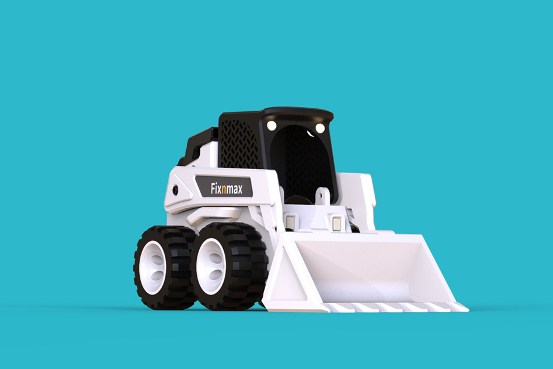
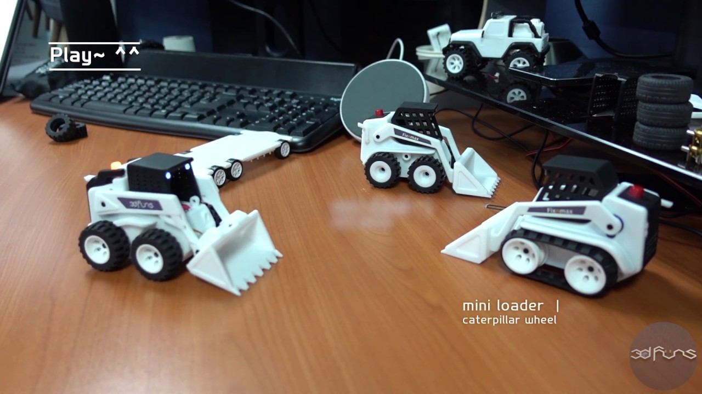
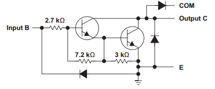
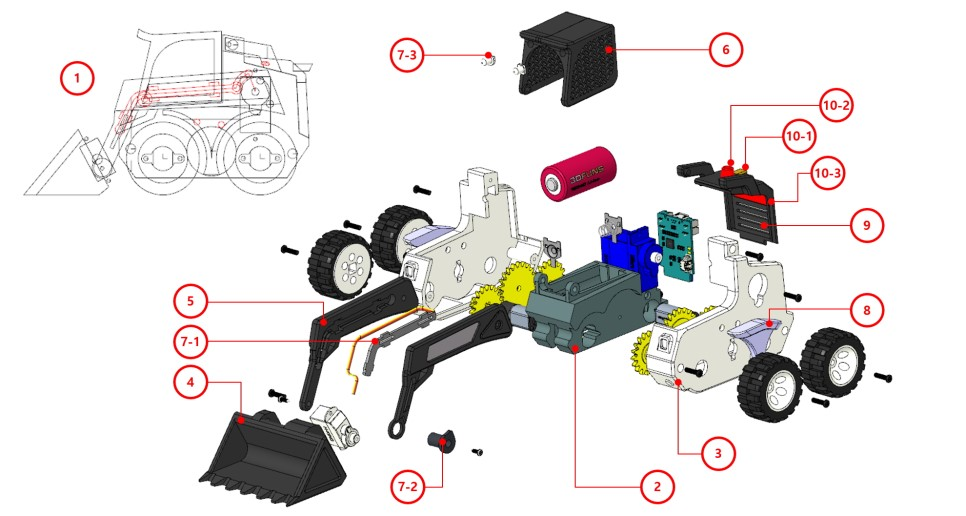

Awesome 3d printed RC Skid loader found [here](https://blog.naver.com/3dfuns/221408721321).



## Youtube video

[](https://www.youtube.com/watch?v=utB9Z3dmve8)

## Hardware configuration

- MCU: FNM Coding Board (Communication Method: Wifi)
- Motor Driver: in Board
- Motor: N10 reduction gear motor
- Servo: SG90 Servo / Hitec HS-40 Super Feather servo
- Battery: 1Cell (3.7v) CR123A
- Front Lihgt: 3pi (White) LED + 220ohm resistor (Option)
- Warning Light: 3pi (Red) LED + 220ohm resistor (Option)
- Controller: RoboRemo App

### MCU

The designer has used a custom board and have not shared the schematics or where to get one. Have to create our own.

#### Controlling DC motor

The ULN2803A is an array of  Darlington transistors, which is a configuration of two transistors (shown in figure 1) that allow for a very high current amplification. This means that, by drawing only a very small amount of current from the input (in this case, the IO pin), the device can provide a much larger amount of current, which is drawn from an external voltage source, and not from the IO pin. In the case of the ULN2803A, each channel can provide a maximum of 500 mA.



- [ESP32 Arduino: Controlling a DC motor](https://techtutorialsx.com/2019/03/29/esp32-arduino-controlling-a-dc-motor/)
- [Using a ULN2803A to control a DC motor](https://techtutorialsx.com/2016/02/08/using-a-uln2803a-to-control-a-dc-motor/)

## Assembly

There is a lot of content, but please do it slowly with the mind that you can do it ~ ^^

​The following is the video sequence and brief information.

There are 24 videos (Part1 ~ Part24) and 17 design parts.​

1. 2d layout (Part1 ~ Part3): This is the sketch that is the basis of the design.
2. bracket motor (Part4 ~ Part6): This is the central design where batteries and wheels are assembled.
3. body left, right (Part7 ~ Part10): Left and right body design.
4. bucket (Part11 ~ Part12): Bucket design.
5. arm left, right (Part13 ~ Part15): Left and right arm design.
6. cab enclosure left, right (Part16 ~ Part17): Left and right driver seat design.
7. Cover left arm, dummy axis left arm, head lamp (Part18): It is the design of the parts and head lamp assembled on the arm.
8. fender (Part19): left and right fender design.
9. cover engine (Part20 ~ Part21): Engine cover design.
10. exhaust, working lamp, tail lamp (Part22): It is designed for exhaust, working lamp and tail lamp.
11. final assembly (Part23 ~ Part24): This is a video of assembling motor, gear, wheel, battery, circuit board, screw, etc.



## Code

```cpp
#include <ESP8266WiFi.h>
#include <WiFiClient.h>
#include <Servo.h>

#define motorPin1_1 4
#define motorPIN1_2 15
#define motorPIn2_1 14
#define motorPIn2_2 12
#define armPin 5
#define bucketPin 13
#define lightFrontPin 16
#define lightEmergencyPin 0

const char *ssid = "FNM_Mini_Loader_4WD_J"; // Phone to this AP
const char *pw = "00010001";                // access password

IPAddress ip(192, 168, 0, 1); // Roboremo Connection IP
IPAddress netmask(255, 255, 255, 0);

const int port = 9876; // Connection Port
int m1speed = 0, m2speed = 0;
int ledFront;
int loaderArmAngle = 90, loaderBucketAngle = 90; // Servo Initial Location
int ledEmergencyOff = LOW;
unsigned long preMillisLed = 0;
const long intervalLed = 1000; //Light bulb interval 1 second (1000ms)
char cmd[100];
int cmdIndex;

Servo loaderArm, loaderBucket;
WiFiServer server(port);
WiFiClient client;

void setup()
{
    pinMode(motorPin1_1, OUTPUT);
    pinMode(motorPIN1_2, OUTPUT);
    pinMode(motorPIn2_1, OUTPUT);
    pinMode(motorPIn2_2, OUTPUT);
    pinMode(lightFrontPin, OUTPUT);
    pinMode(lightEmergencyPin, OUTPUT);
    analogWrite(motorPin1_1, 0);
    analogWrite(motorPIN1_2, 0);
    analogWrite(motorPIn2_1, 0);
    analogWrite(motorPIn2_2, 0);
    digitalWrite(lightFrontPin, LOW);
    digitalWrite(lightEmergencyPin, LOW);

    loaderArm.attach(armPin);
    loaderArm.write(loaderArmAngle);
    loaderBucket.attach(bucketPin);
    loaderBucket.write(loaderBucketAngle);

    delay(1000);

    WiFi.softAPConfig(ip, ip, netmask); // configure ip address for softAP
    WiFi.softAP(ssid, pw);              // configure ssid and password for softAP
    server.begin();                     // start TCP server
}

boolean cmdStartsWith(const char *st)
{
    for (int i = 0;; i++)
    {
        if (st[i] == 0)
            return true;

        if (cmd[i] == 0)
            return false;

        if (cmd[i] != st[i])
            return false;
        ;
    }

    return false;
}

void exeCmd()
{

    if (cmdStartsWith("m1 "))
    {
        m1speed = atoi(cmd + 3);
        Serial.println(m1speed);
    }

    if (cmdStartsWith("m2 "))
    {
        m2speed = atoi(cmd + 3);
        Serial.println(m2speed);
    }

    if (m1speed > 0)
    {
        analogWrite(motorPin1_1, m1speed);
    }

    if (m1speed < 0)
    {
        analogWrite(motorPIN1_2, -m1speed);
    }

    if (m1speed == 0)
    {
        analogWrite(motorPin1_1, 0);
        analogWrite(motorPIN1_2, 0);

        if (m1speed == 0)
        {
        }
    }

    if (m2speed > 0)
    {
        analogWrite(motorPIn2_1, m2speed);
    }

    if (m2speed < 0)
    {
        analogWrite(motorPIn2_2, -m2speed);
    }

    if (m2speed == 0)
    {
        analogWrite(motorPIn2_1, 0);
        analogWrite(motorPIn2_2, 0);

        if (m1speed == 0)
        {
        }
    }

    if (cmdStartsWith("arm "))
    {
        loaderArmAngle = atoi(cmd + 3);
        loaderArm.write(loaderArmAngle);
    }

    if (cmdStartsWith("buc "))
    {
        loaderBucketAngle = atoi(cmd + 3);
        loaderBucket.write(loaderBucketAngle);
    }

    if (cmdStartsWith("fl"))
    {
        ledFront = (ledFront == LOW) ? HIGH : LOW;
        digitalWrite(lightFrontPin, ledFront);
    }
}

void loop()
{
    if (!client.connected())
    {
        client = server.available();
        return;
    }

    if (client.available())
    {
        char c = (char)client.read();
        if (c == '\n')
        {
            cmd[cmdIndex] = 0;
            exeCmd();
            cmdIndex = 0;
        }
        else
        {
            cmd[cmdIndex] = c;
            if (cmdIndex < 99)
                cmdIndex++;
        }
    }

    unsigned long currMillis = millis();

    if (currMillis - preMillisLed >= intervalLed)
    {
        preMillisLed = currMillis;
        ledEmergencyOff = (ledEmergencyOff == LOW) ? HIGH : LOW;
        digitalWrite(lightEmergencyPin, ledEmergencyOff);
    }
}
```
