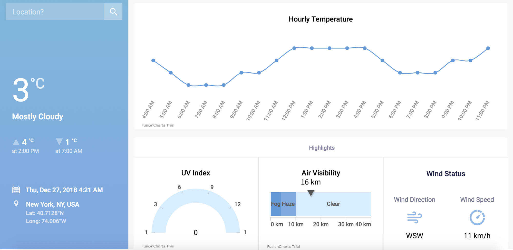
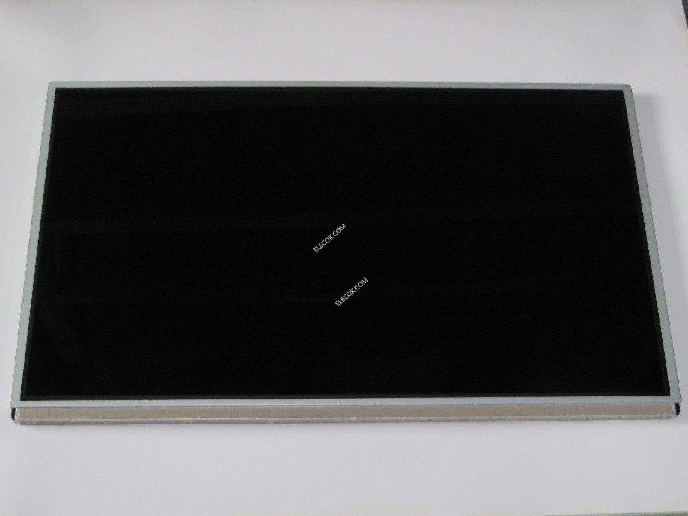
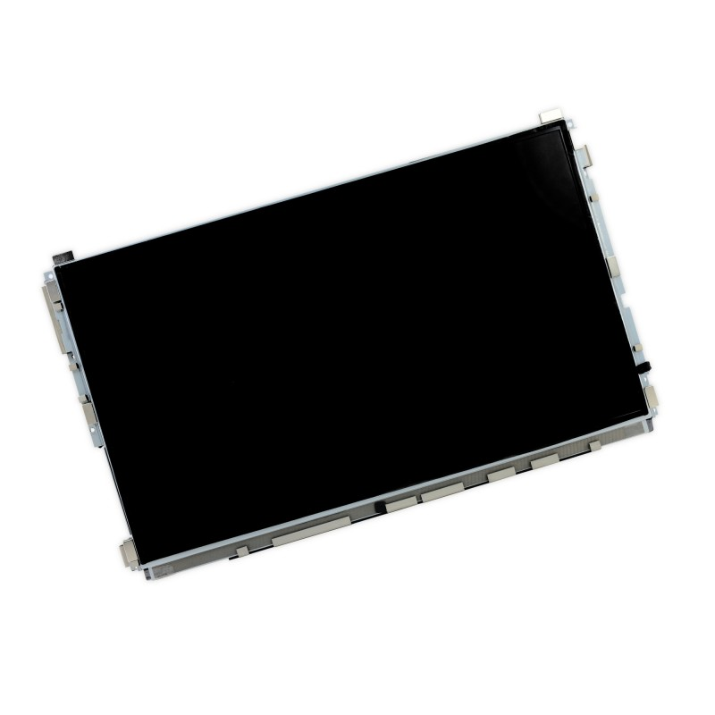

## Dashboard



<https://www.smashingmagazine.com/2019/02/interactive-weather-dashboard-api-vue-js/>

## Inspiration

- <https://generated.space/>

## Libraries

### P5.js

Javascript library for processing
<https://p5js.org/get-started/>

### Vibrant.js

Get colors from image
<https://jariz.github.io/vibrant.js/>

### Image Transition by Szenia Zadvornykh

https://codepen.io/last-first/pen/QNoWmO

### Pixel sort

Pixel sorting is an interesting, glitchy effect which selectively orders the pixels in the rows/columns of an image.


- [github.com: Pixelsort](https://github.com/satyarth/pixelsort)
- [satyarth.me: pixel sorting](http://satyarth.me/articles/pixel-sorting/)

### Echoprint

Echoprint is an open source music fingerprint and resolving framework powered by the The Echo Nest. The code generator (library to convert PCM samples from a microphone or file into Echoprint codes) is open source (MIT licensed) and free for any use.

- [Echoprint codegen](https://github.com/spotify/echoprint-codegen)
- [Echoprint server](https://github.com/spotify/echoprint-server)

## Displays

### LG LM270WQ1-SDE3 - 27"



Driver:

- [HDMI+DP+DVI Controller Driver Board Kit for 2560×1440 2K LCD LM270WQ1-SDE3](https://www.ebay.com/itm/HDMI-DP-DVI-Controller-Driver-Board-Kit-for-2560-1440-2K-LCD-LM270WQ1-SDE3/123686129209)

### LG LM215WF3-SDA1 - 21.5"



Driver:

- [EDP Converter Board Driver kit HDMI/DVI/VGA Inputs for 1920X1080 LM215WF3-SDA1](https://www.ebay.com/itm/EDP-Converter-Board-Driver-kit-HDMI-DVI-VGA-Inputs-for-1920X1080-LM215WF3-SDA1/372235231813)


## Raspberry pi

`sudo nano /boot/config.txt`:

```sh
# Display orientation. Landscape = 0, Portrait = 1
display_rotate=1
```

`nano ~/.config/lxsession/LXDE-pi/autostart`

```sh
@xset s off
@xset -dpms
@xest s noblank
@chromium-browser --noerrdialogs --incognito --kiosk http://dakboard.com/app
```
