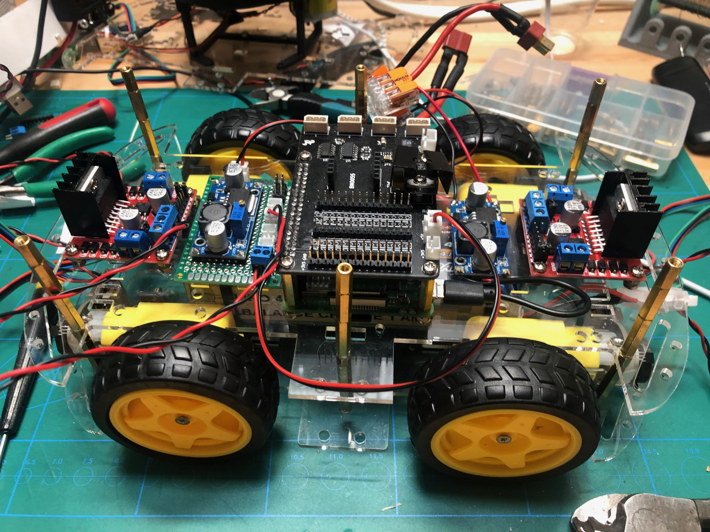

## Components

- [TT Motor with Encoder (6V 160RPM 120:1)](https://www.dfrobot.com/product-1457.html)
- [Huskylens](https://www.dfrobot.com/product-1922.html)
- [L298N Motor driver](https://www.teachmemicro.com/use-l298n-motor-driver/)

## Inspiration

- [An Autonomous Rover](https://www.instructables.com/id/An-Autonomous-Rover/)
