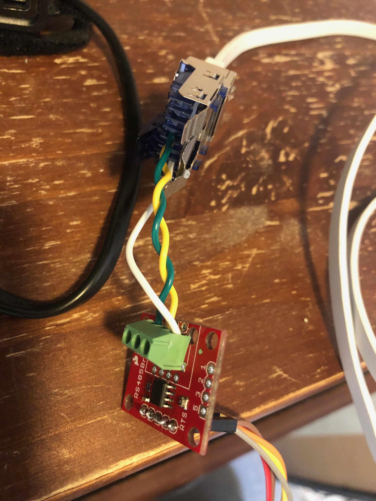

Model: Systemair  VR 400 DCV/B R

## Images


Only able to get transmitted data.




Pin 4 -> B (Blue -> Yellow), Pin 5 -> A (White/Blue -> Green)


 (Note. I know A/B is switched around on this picture)

## Hardware

- [CC-USB-RS485-150U](https://www.ebay.com/itm/CC-USB-RS485-150U-EN-MPPT-Solar-Epsolar-Connected-To-PC-Communication-Cable-AM/253067353581?_trkparms=aid%3D111001%26algo%3DREC.SEED%26ao%3D1%26asc%3D20160908105057%26meid%3Dce8491f1276c43d089a89956ae6cabd5%26pid%3D100675%26rk%3D1%26rkt%3D15%26mehot%3Dnone%26sd%3D253067353581%26itm%3D253067353581%26pmt%3D0%26noa%3D1%26pg%3D2380057%26brand%3DUnbranded&_trksid=p2380057.c100675.m4236&_trkparms=pageci%3Af5d08b4f-e244-11ea-b6e6-74dbd1801c92%7Cparentrq%3A07db31991740aa465e7df92ffffff9aa%7Ciid%3A1) (ttyACM0).

- [FT232 USB cable](https://cdn-shop.adafruit.com/datasheets/FT232_Model.pdf) (ttyUSB0) connected with [SparkFun Transceiver Breakout - RS-485](https://www.sparkfun.com/products/10124) where only the transmission led is blinking.

### USB to RS485

```bash
/dev/ttyACM0
```

## Software

[Airiana - SystemAir control](https://github.com/BeamCtrl/Airiana)

```bash
curl https://bootstrap.pypa.io/get-pip.py -o get-pip.py
python get-pip.py
```

## Issues

With the two hardware setups I have, I currently do not get anything back from the device. I have opened an [issue](https://github.com/BeamCtrl/Airiana/issues/10) about Airiana repo, hoping to get some eye opening to get this fixed.

Airiana dump of RAM/err and RAM/out:
[Gist Dump](https://gist.github.com/danielkaldheim/cca07903f6734031c1fda6edd6703354)
