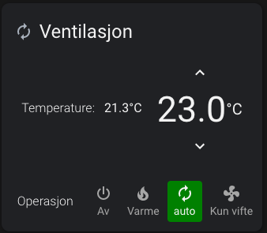

I've been working on this project for quite a while now. Not continuously but occasionally on a couple of evenings, now and then for the last 7 years.

When I bought the house I'm currently living in, in 2013, it was equipped with a System Air ventilation system. Since it only had a remote controller mounted on the wall in the first floor, and we mostly spent our time on the second floor, I played with the idea of a mobile application that could connect to the ventilation and adjust the temperature and the amount of air the unit was blowing.

At that time, there were no cheap solutions, and it was not so important to make this work that I prioritized buying the System Air network unit.

So after some research I found the System Air's modbus specification document online and see if I could connect a RS-485 to RS-232 component I bought from ebay. After some failed attempts, I gave up for a couple of years.

On and off since the first Ebay component I tried with other RS-485 adapters and cables without success. Clearly I was doing it wrong.

In 2020, I borrowed a FTDI USB to RS-485 cable from a colleague of mine which surprisingly worked. It wasn't until I read the specification for the cable I understood what I have been doing wrong the last couple of years. The ventilation modbus system was terminated with a 120Ohm resistor to close the RS-845 lane [RS-485 basics](https://e2e.ti.com/blogs_/b/analogwire/archive/2016/07/28/rs-485-basics-when-termination-is-necessary-and-how-to-do-it-properly). And every component I have been trying with had the termination resistor solder into the PCB (or the wrong wiring). I knew that the RS-485 should be terminated with a resistor and I was so sure that my slave component should be terminated I completely overlooked this.

Anyways after connecting the FTDI USB to RS-485 and got some result back, I set up an Raspberry Pi with [Airiana](https://github.com/BeamCtrl/Airiana) software written by [Daniel Halling](https://github.com/BeamCtrl). This software have some awesome features like planning for weather changes and detects showering.

Since I like to thinker with electronics and also wanted the form factor to be a little smaller, I built a circuit board with RS-485 and a ESP32 microcontroller that has WiFi and Bluetooth.

Since Airiana is running python code I had to implement the modbus and ventilation control software my self. But in the future I would love to port Airiana code to work on this setup.

The software is publishing and listening on a MQTT queue which enabled me to change the fan speed, heating element and turn it on or off. I also wrote a simple PID controller to set at target temperature the ventilation system should hold.

Since I use MQTT it was simple to set up in Home Assistant.

Here are some screenshots from my Home assistant setup:

Climate control, set target temperature and change modes (Off, heat only, automatic, fan only).

Climate control, set target temperature, change mode and fan speed.

Filter state, how long current filter has been installed, and percentage left.

Temperature debug information.

This project is still work in progress, but I you're interested checkout this [repository](https://github.com/danielkaldheim/systemair-esp32-bridge) or my [notes](/projects/systemair).
